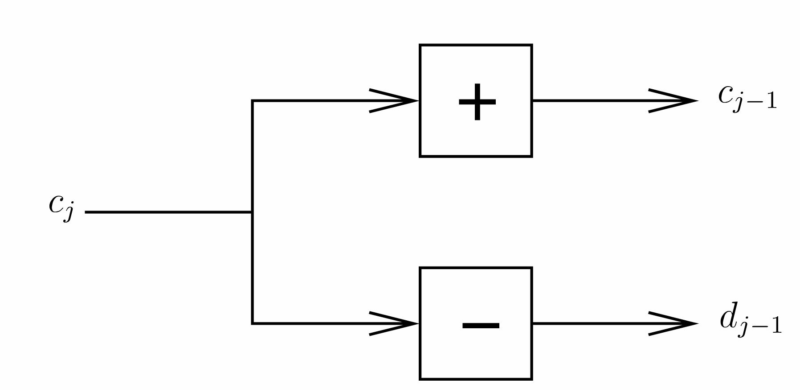

These are my personal notes on wavelets, mainly for the sake of going back to these for references and cleaner understanding in future.

## Wavelets Introduction

Wavelets are objects that oscillate but decay fast in time, hence are 'little'. The simplest form of wavelet is the *Haar mother wavelet* given as follows 

(@eq01) $$
\begin{aligned} 
\psi (x) & = 1,     x \in [0, 0.5] \\
         & = -1,     x \in [0.5,1] \\
         & = 0,     elsewhere 
\end{aligned}
$$

If one has a mother wavelet, one can generate *wavelets* by dilation and translation.

$$ \psi_{j,k}(x) = 2^{\frac{j}{2}} \psi(2^j x - k)  $$

It turns out from this definition that $\psi_{j,k}$ inner product with $\psi_{j^{'}, k^{'}}$ is equal to 0 unless $j=j^{'}$ and $k=k^{'}$, meaning that these wavelets are all orthogonal. Also $\{\psi_{j,k}(x)\}_{j,k \in \mathbb{Z}}$ form an orthogonal basis of $L^2(\mathbb{R})$. 

$$ f(x) = \sum_{j} \sum_{k} d_{jk} \psi_{j,k}(x)  $$

and 

$$ d_{j,k} = < f,\psi_{j,k} > = \int_{-\infty}^{\infty} f(x) \psi_{j,k}(x)  dx $$

We call $d_{j,k}$ the wavelet coefficients. $d_{j,k}$ quantifies the 'amount' of $\psi_{j,k}$ contained in $f$.So, if $d_{j,k}$ is large, that means that f has some oscillatory variation at $2^{-j}k$ with oscillatory wavelength proportional to $2^{-j}$. This is important for structure extrcation of $f$. 

Wavelets can also pick up the discontinuities in a function. For Haar case, only Haar coefficients $d_{j,k}$ that can be influenced by a discontinuity at $x^{\star}$ are the ones for which $2^{-j}k \leq x^{\star} \leq 2^{-j} (k+1)$. For Haar wavelets, only one wavelet per scale overlaps with the discontinuity. This is in contrast with Fourier series where every basis (sine/cosine) interacts with the discontinuity no matter where they occur, thereby influencing all the Fourier coefficients.  

Wavelet approximation

$$ f_{J}(x) = \sum_{j= -\infty}^{J} \sum_{k=-\infty}^{\infty} d_{jk} \psi_{j,k}(x) $$

if $J$ is large, then it is called fine-scaled approximation, if $J$ is low, then it is called coarse scaled approximation.

To compute wavelet transform, use the function *wd* in **wavethresh** R package. Computation of the wavelet coefficients is a $O(n)$ operation while Fourier coefficients using Fast Fourier Transform *fft** is a $O(n log n)$ operation. So, for large $n$, wavelet coefficients are computed in lesser time. 

## Multi-scale Analysis

The term 'multiscale' means representing a function at a set of scales, where these scales are generated simultaneously.
The history of wavelets is covered by Jawerth and Swelden (1994).

We start with wavelet transform of a sequence. Lets begin with a discrete sequence of data $y= (y_1, y_2, \cdots, y_n)$. Let us assume as of now $n= 2^J$, although we shall relax this assumption later. We describe next how to extract multiscale information from $y$. We first compute 

$$ d_{k} = y_{2k} - y_{2k-1} $$

for $k=1,2,\cdots, \frac{n}{2}$. If $y_{2k}$ is very similar to $y_{2k-1}$, then the value of $d_{k}$ will be pretty small. $d_{k}$ will be big only when $y_{2k}$ varies significantly from $y_{2k-1}$. So, $d_{k}$ encodes the difference or detail at the location $\frac{(2k+2k-1)}{2} = 2k - 0.5$. Now define 

$$ c_{k} = y_{2k} + y_{2k-1}  $$

While $d_{k}$ represents fine scale evaluation of $y_{k}$, $c_{k}$ represents a coarse scale evaluation of the data vector. 
If we want coarser detail, we can compare adjacent $c_{k}$. This leads to computing coarser scale evaluation and then a detail of the coarse evaluation in each step. So, the finest level averages can be called $c_{J-1,k}$ and the finest level details $d_{J,k}$. Then 

$$ d_{J-2,l} = c_{J-1,2l} - c_{J-1, 2l-1} $$

for $l=1,2,\cdots, \frac{n}{4}$. Here $d_{J-2,l}$ can be looked at as scale two differences whereas $d_{J-1,k}$ can be looked at as scale one differences. We can repeat 

$$ c_{J-2,l} = c_{J-1,2l} + c_{J-1, 2l-1} $$

and then continue as above to produce detail and smoothed coefficients at consecutively coarser scales. Here $d_{j,k}$ represents detail or wavelet coefficients and $c_{j,k}$ the scaling or father wavelet coefficients. 

This pyramid algorithm is a type of Discrete Wavelet Transform (DWT) for vectors. The wavelets underlying the transform above are the Haar wavelets. The original sequence we can get back exactly using the $d_{j,k}$ and $c_{0,0}$ as follows 

$$ c_{j-1,2k} = (c_{j-2,k} + d_{j-2,k})/2 $$

$$ c_{j-1,2k-1} = (c_{j-2,k} - d_{j-2,k})/2 $$

The wavelet coefficients set is usually extremely sparse. Suppose we have the vector $(1,1,1,1,2,2,2,2)$ and we apply the method depicted above, then we will get only one non zero coefficient given by $d_{0}=4$. Piecewise smooth functions usually have sparse representations in wavelets. Note that in the above case, the energy of the input (square of the norm) is 20 while that of the output is 16. We want to make the enrgy for the output and the input be same. 

To solve this energy problem, we introduce a multiplier 

$$ d_{k} = \alpha (y_{2k} - y_{2k-1}) $$

$$ c_{k} = \alpha( y_{2k} + y_{2k-1}) $$

One can easily show that $d^2_{k} + c^2_{k} = y^2_{2k} + y^2_{2k-1}$ if $\alpha=\sqrt{\frac{1}{2}}$. The wavelet coefficients can be written as 

$$ d = Wy $$

But matrix multiplication method like this requires $O(n^2)$ operations, so this procedure is not the best to derive $d$. 
The pyramidal algorithm we described above can be performed in $O(n)$ operations. Each coefficient is estimated using one operation and these coefficients are then cascaded to other coefficient estimation, thereby making the algorithm faster.

Suppose we are now provided with a function $f$. We first start with a fine-scale local averaging of the function $f$. Wed define the Haar father wavelet as 

$$ \phi(x)  = 1   x \in [0,1] $$

$$ c_{J,k} = \int_{0}^{1} f(x) 2^{J/2} \phi(2^Jx-k) dx $$

Also

$$ c_{J,k} = <f, \phi_{J,k} > = \int_{0}^{1} f(x)  \phi_{J,k} dx $$

The function $\phi_{J,k}$ takes the value $2^{J/2}$ in the interval $I_{J,k} = [2^{-J}k, 2^{-J}(k+1)]$ where 
$k$ can vary from $0$ to $2^J-1$. $c_{J,k}$ is the smoothing of the function $f$ over this interval.

$$ f_{J}(x) = \sum_{k=0}^{2^J-1} c_{J,k} \phi_{J,k}(x)  $$

There is nothing special about $J$ as of now. However, it can be shown that if we look at $c_{J-1,k}$, then we can write this as 

$$ c_{J-1,k} = 2^{-1/2} (c_{J,2k} + c_{J,2k-1}) $$

from the definition of $c$. This happens because for Haar wavelet, 

$$ \phi(y) = \phi(2y) + \phi(2y-1) $$

$$ \phi(2^{J-1}x -k) = \phi(2^{J}x -2k) + \phi(2^{J}x -2k-1) $$

We can write 

$$ f_{j+1}(x) = \sum_{k=0}^{2^j -1} c_{j,k} \phi_{j,k}(x) +  \sum_{k=0}^{2^j -1} d_{j,k} \psi_{j,k}(x) $$

The first term is equal to $f_{j}(x)$. 

Consider a ladder of spaces 

$$ \cdots  < V_{-2} < V_{-1} < V_{0} < V_{1} < V_{2} < \cdots  $$

As $j$ becomes larger and larger, we include more and more functions of finer resolution. As $j$ tends to $\infty$, we include all the functions. As $j$ becomes more and more negative, we include fewer and fewer functions with less detail. As $j$ tends to $-\infty$, the intersection of the spaces gives us the $0$ function. Also if $f(x)$ belongs to $V_j$, then $f(2x)$ belongs to $V_{j+1}$. This is called 'interscale' linkage. If we location shift a function, it still remains in the same space. 

We say that $\phi(x)$ is an element of $V_0$ and that $\{ \phi_{j,k}(x) \}_{k \in \mathbb{Z}}$ represents the orthonormal basis for $V_j$. The conditions listed above is called the multi-resolution analysis of a space of functions. The challenge for wavelet design is to find $\phi(x)$ that satisfies the design of multi-resolution analysis of functions besides othwer desirable properties. 

Given a function $f$, let 

$$ P_{j}f = \sum_{k} c_{jk} \phi_{jk}  $$

Then $P_{j}f$ is the projection of $f$ in the space $V_{j}$ space of father wavelets. 

We now define the *dilation equation*. Since $\{ \phi_{1,k}(x) \}$ represents the basis for $V_1$ and $\phi(x)$ belongs to $V_0$ and hence to $V_1$, so we can write 

$$ \phi(x)  = \sum_{n} h_{1,n} \phi_{1,n}(x) $$

## Daubechis Theorem

if $\{ V_j \}$ with $\phi$ represents a MRA for $L^2(\mathbb{R})$, then we can find an orthonormal wavelet basis $\psi_{j,k}$, that satisfies 

$$ P_{j+1}f = P_{j}f + \sum_{k} <f, \psi_{j,k}> \psi_{j,k} $$

One possibility for construction of $\psi(x)$ is given by 

$$ \hat{\psi}(\omega) = exp(i\omega/2) \bar{m_0 (\omega/2 + \pi)} \hat{\phi}(\frac{\omega}{2}) $$

$$ m_0 (\omega) = \frac{1}{\sqrt{2}} \sum_{n} h_n exp(-in \omega) $$

or equivalently

$$ \psi(x) = \sum_{n} (-1)^{n-1} \bar{h_{-1-n}}\phi_{1,n}(x) $$

$\psi$ is the mother wavelet function here. Daubechis theorem makes it clear that the difference $(P_{j+1} - P_{j})f$ can be explained as a linear combination of wavelets. The space spanned by $\{ \psi_{j,k}(x) \}_{k \in \mathbb{Z}}$ is called $W_{j}$ which is the space of the detail lost in going from $V_{j}$ to $V_{j+1}$. So, one can write 

$$ V_{j+1} = V_{j} + W_{j} $$

Wavelets may possess several vanishing moments. For example, a function $\psi$ is said to have $m$ vanishing moments if it satisfies 

$$ \int x^{l} \psi(x) dx = 0 $$

for $l=0,1,2, \cdots, m-1. If a function is pretty smooth with occassional discontinuities, then the wavelet coefficients on the smooth parts will mostly be small or 0, if the behavior at that point is less than certain order of polynomial. This property has important consequences because it leads to sparse representation of smooth functions by the wavelets. the non-zero coefficients mainly correspond to discontinuities or sharp changes. The *wvmoments* function computes the number of vanishing moments for a wavelet. 

## Daubechis compactly supported wavelets

One of the biggest achievements in wavelet theory was the construction of compactly supported wavelets that are smoother than Haar wavelets and has more vanishing moments than Haar wavelets. Daubechis's wavelets were obtained by ingenious solutions to the dilation equation. Each member of each family is indexed by a number $N$, representing the number of vanishing moments. *wavethresh* contains two families of Daubechis wavelets - *least asymmeteric (symmlets)* and *extremal phase*. Unless it is Haar wavelet, real valued compact orthonormal wavelets cannot be symmetric and least-asymmetric family is a choice that tries to get close to symmetry as much as possible. The *extremal phase* family has vanishing moments ranging from one to ten and *least-asymmetric* from four to ten. The filter coefficients $\{ h_n \}$ are reported. For Haar, there are two coefficients both equal to $\frac{1}{\sqrt{2}}$ and number of vanishing moments is $1$. For a case with number of vanishing moments equal to $4$, we will have $8$ non zero values of $h_{n}$. 

## Algorithm for Discrete Wavelet Transform

The dilation equation for father wavelets can be written as 

$$ \phi(x) = \sum_{n} h_n \phi_{1,n}(x) $$

and corresponding wavelets in $V_{J-1}$

$$ \phi_{J-1,k} (x) =  \sum_{n} h_n \phi_{J,n+2k}(x) $$

From this it follows that 

$$ c_{J-1,k} = \sum_n h_n c_{J,n+2k} $$

with a little re-arrangment, this can be writtena as

$$ c_{J-1,k} = \sum_n h_{n-2k} c_{J,n} $$

Similarly 

$$ d_{J-1,k} = \sum_n g_{n-2k} c_{J,n}  $$

these two equations hold for any $j=1,2,\cdots, J-1$.

Define the even dyadic decimation operator $D_0$ as 

$$ (D_0 x)_{l} = x_{2l} $$

We write 

$$ c^{\star}_{J-1,k} = \sum_n h_{n-k} c_{J,n}  $$

Then use dyadic decimation to pick 

$$ c_{J-1,k}  = c^{\star}_{J-1,2k} $$

So, 

$$ c_{J-1} = D_0 H c_{J} $$

$$ d_{J-1} = D_0 G c_{J}  $$

Similarly, we get 

$$ c_{j} = (D_0 H)^{J-j} c_{J} $$
$$ d_{j} = D_0 G (D_0 H)^{J-j-1} c_{J} $$

Note that $d_{j},c_{j}$ are vectors of length $2^{j}$. So, now we only need to find out $c_{J,k}$, the father wavelet coefficients.  Estimate 

$$ c_{J,k} = <f, \phi_{J,K} >  = E_{f} [\phi_{J,K}(X)]$$

where $X \sim f$. Draw $X_1, X_2, \cdots, X_n$ from $f$ and estimate the above by 

$$ \hat{<f, \phi_{J,K} >} = \frac{1}{n} \sum_{i=1}^{n} \phi_{J,K}(X_i) $$

Also read about decimated wavelet transforms, coiflets although these are not so frequently used. 

